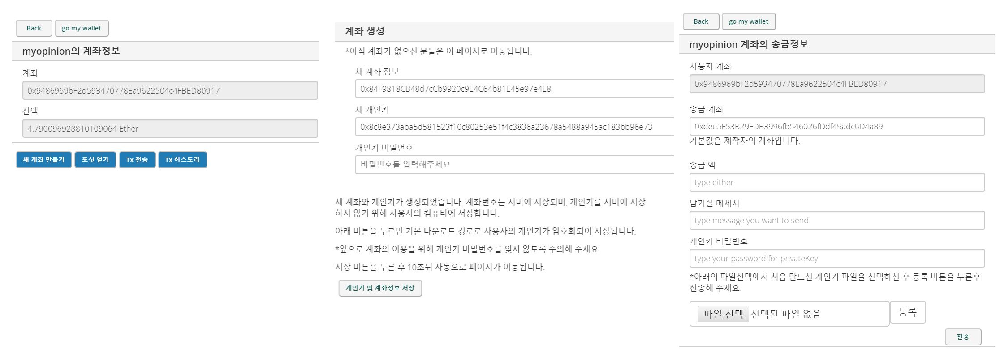
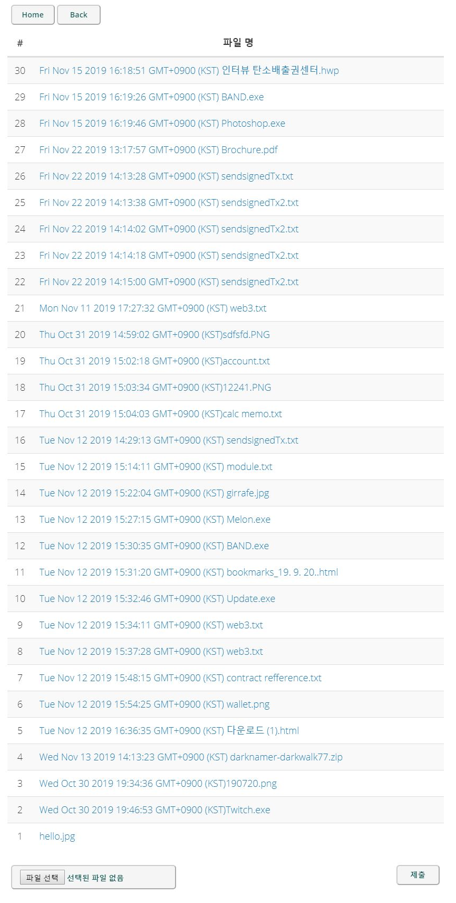
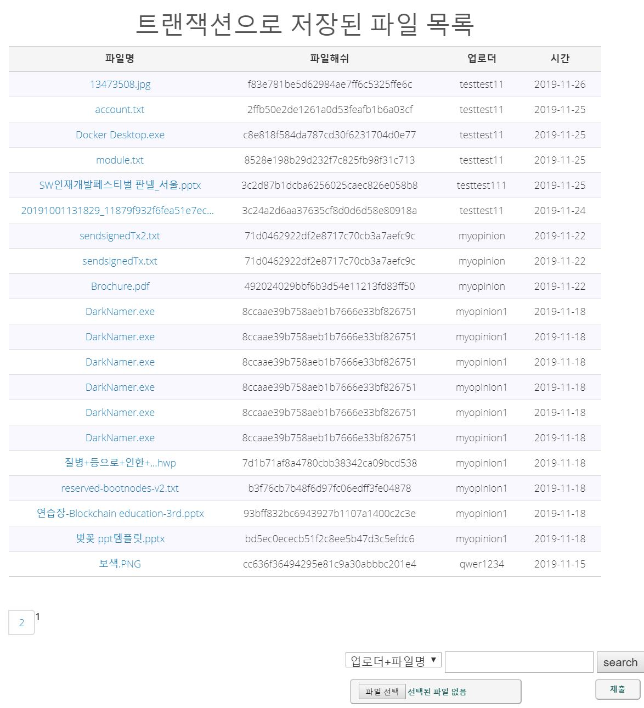

# 파일 위변조 확인

파일 위변조를 확인하기 위한 블록체인 프로젝트 입니다.

1. 지갑기능
2. 파일 업로드(해쉬 추출, 트랜잭션 전송)
3. 파일 리스트 및 조회

의 크게 3가지 기능으로 구분됩니다.


### 소개

1. ##### 사용
```
$ git clone https://github.com/PeterKimG/calcchain.git
$ cd calcchain
$ npm i
$ node index.js
```

2. ##### 지갑 페이지



- 사이트 계정생성 후 지갑 탭 이동시, 이더리움 테스트넷 계좌 생성후 private Key 를 json 형태로 encrypt 해 저장.
- 후에 json file 로 승인후 송금 실행 가능


3. ##### 파일 업로드 페이지



- 파일 업로드 시에 서버에 저장과 동시에 해쉬 값(SHA-256) 추출 후 transaction 에 담아 전송.
- list up

4. ##### 파일 조회 페이지



- 파일 리스트 출력 및 사용자의 파일을 선택 후에 조회 가능.
